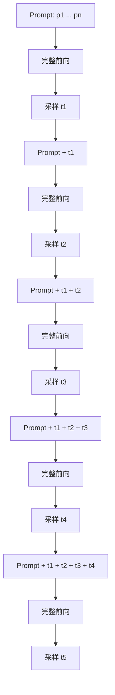

# 推理系统专题面试稿

## 说明

这份文档围绕 `KV Cache`、`PagedAttention`、`Continuous Batching`、`Speculative Decoding`、`TensorRT-LLM` 和在线推理性能调优整理了一组高频面试题。  
目标不是堆术语，而是给出一版可以直接复述的答案：先说问题，再说机制，最后说工程 tradeoff。

## 1. 能否画图或用伪代码说明，在没有 KV Cache 的情况下，生成 5 个 token 的完整计算过程？

可以。没有 `KV Cache` 时，每生成一个新 token，都要把“当前已有的整段序列”重新做一次完整前向。

### 过程示意



### 伪代码

```python
tokens = prompt_tokens[:]
generated = []

for _ in range(5):
    logits = model(tokens)          # 重算整段 tokens
    next_token = sample(logits[-1]) # 只取最后一个位置
    tokens.append(next_token)
    generated.append(next_token)
```

### 面试回答重点

- 第 2 步会重算 prompt
- 第 3 步会重算 prompt + `t1`
- 越往后重复计算越多

一句话：

> 没有 `KV Cache` 时，decode 阶段不是增量计算，而是“每步都重跑到当前长度为止的整段序列”。

## 2. 请详细解释 KV Cache 的核心原理，为什么它能显著加速大模型推理？

`KV Cache` 的核心原理是：把历史 token 在每一层 attention 中产生的 `K/V` 保存下来，后续 decode 时不再重算历史部分，只为新 token 计算一次 `Q/K/V`，然后让这个新 token 的 `Q` 去读历史缓存。

### 为什么能加速

- 没有 cache：每步都重算历史 token 的 K/V
- 有 cache：历史 K/V 直接复用
- 新增开销只和“新 token”有关，而不是和“整段历史”一起增长

### 本质变化

- 从“整段重复前向”
- 变成“增量前向 + 读取历史状态”

### 但它也带来新问题

- 显存占用大增
- decode 更容易变成 memory-bound
- 需要精细的 cache 分配、淘汰和布局管理

一句话：

> `KV Cache` 不是减少 attention 的数学依赖，而是把历史状态持久化，避免重复计算，从而把 decode 的主要成本从“重算”转成了“读缓存”。

## 3. 在 PagedAttention 中，当多个序列共享相同的 Prompt 前缀时，物理块是如何复用的？请说明 Copy-on-Write 机制的工作原理。

在 `PagedAttention` 里，多个序列如果共享相同 prompt 前缀，它们并不需要各自复制一份 prefix KV。更常见的做法是：

- 每个序列有自己的 `block table`
- 多个序列的前缀逻辑块可以指向同一组物理块

比如：

```text
Seq A: L0 -> P7, L1 -> P3
Seq B: L0 -> P7, L1 -> P5
```

其中 `L0` 是共享前缀块，所以两个序列都指向同一个物理块 `P7`。

### Copy-on-Write（写时复制）

`Copy-on-Write` 的原则是：

- 只读共享时，不复制
- 一旦某个序列要写共享块，先复制，再写新块

流程：

1. 多个序列先共享同一个物理 block
2. 物理 block 带引用计数
3. 若某个序列写入时发现引用计数 > 1
4. 分配新物理块，复制旧内容
5. 只更新当前序列自己的 `block table`

### 它解决的问题

- 前缀共享时避免重复占显存
- 又能保证分叉后每条序列独立演化

## 4. 在 PagedAttention 的 Block 管理中，如何实现多个序列之间的内存共享？请结合 Beam Search 场景说明。

多个序列之间的共享依赖两个核心机制：

- `block table`
- 物理块引用计数

### 一般场景

- 逻辑上每个请求维护自己的 KV block 序列
- 物理上多个请求的逻辑块可以指向同一个物理块
- 只要内容相同，就继续共享

### Beam Search 场景

`Beam Search` 非常适合解释这件事，因为：

- 多个 beam 起初共享完全相同的 prompt
- 扩展早期，历史前缀仍高度重合
- 如果每个 beam 都复制全部 KV cache，显存会近似随 beam 数线性膨胀

PagedAttention 的做法是：

- 所有 beam 共享同一批 prefix blocks
- 每个 beam 仅在新生成 token 处开始分叉
- 分叉时再借助 `Copy-on-Write` 或新 block 分配形成独立路径

一句话：

> Beam Search 下，PagedAttention 的 block 共享本质上是在利用“前缀长期一致、后缀逐渐分叉”这个结构特点，把大部分 KV cache 做成共享只读状态。

## 5. 请解释 PagedAttention 中 Copy-on-Write（写时复制）机制的原理，以及它在 LLM 推理中解决了什么问题？

`Copy-on-Write` 的原理可以概括成一句话：

> 共享时不复制，写入时才复制。

在 LLM 推理里，它主要服务于：

- Prefix sharing
- Beam Search
- 分叉式生成

### 具体原理

- 多个序列共享某个前缀物理块
- 这个物理块引用计数大于 1
- 当其中一个序列需要写这个块时
- 系统先复制一个新块，再让当前序列写新块
- 其他序列继续指向旧块

### 解决的问题

- 节省显存
- 避免共享前缀被误改
- 让“共享 prefix + 独立分支”同时成立

## 6. 在 AI 推理部署中，批大小（Batch Size）如何影响延迟？请分析其背后的原理，并说明在实际工程中如何根据延迟要求选择合适的批大小。

`Batch Size` 对延迟的影响不能只看 kernel 本身，要看：

- batching delay
- execution delay
- queueing delay

### 一般规律

- batch 增大，吞吐通常更高
- 但单请求可能要等更多请求一起凑批
- 所以端到端延迟不一定下降

### 背后原理

- 大 batch 能提高 GPU 利用率，摊薄 launch 开销
- 但在线服务里，请求必须等待形成 batch
- 对 decode 阶段，attention 本身常是 memory-bound，batch 再加大后收益会递减

### 工程上的选择方式

- 延迟敏感：小 batch + 动态 batching
- 吞吐优先：更大 batch，但要受显存和 P99 限制
- 常用策略：`max_batch_size + max_wait_time + continuous batching`

一句话：

> 在线推理里，batch size 不是越大越好，而是要平衡“GPU 更满”和“请求等更久”这两件相反的事。

## 7. 假设你负责一个在线推理服务，产品要求 P99 延迟不超过 100ms，同时希望尽可能提升 QPS。请描述你的优化思路和具体手段。

这类题最稳的答法是“先拆账本，再分层优化”。

### 第一步：拆延迟账本

- 网络和网关
- 排队和 batching
- prefill
- decode
- 后处理

### 第二步：分层优化

#### 模型层

- 量化：`FP8 / INT8`
- 更友好的 head 设计：`MQA / GQA`

#### kernel 层

- `FlashAttention / FlashDecoding`
- fused kernels
- CUDA Graphs

#### 运行时层

- `KV Cache`
- `PagedAttention`
- `Continuous Batching`
- `Prefix Caching`
- `Speculative Decoding`

#### 系统层

- cache-aware routing
- async tokenizer / postprocess
- admission control
- topology-aware placement
- 必要时 `PD 分离`

### 最后要明确一点

如果要求严格 `P99 <= 100ms`，我会优先保时延，再追吞吐：

- 控制队列长度
- 控制最大等待窗口
- 不盲目追大 batch
- 必要时对大请求做隔离或限流

## 8. 请详细解释 Speculative Decoding（推测解码）的原理，以及它是如何加速大模型推理的？

`Speculative Decoding` 的核心思想是：

- 让一个更快的小模型（draft model）先猜多个 token
- 再让更强的大模型（target model）并行验证
- 一次可能确认多个 token，从而减少 target model 的串行步数

### 基本流程

1. draft model 连续生成 `k` 个候选 token
2. target model 并行检查这些 token
3. 接受最长一致前缀
4. 若后面不一致，则从 target 路径继续

### 为什么能加速

- target model 本来必须逐 token 顺序生成
- speculative 让 target 有机会“一次确认多个 token”
- 于是减少了 target model 的 decode 次数

### 收益取决于

- draft 是否足够快
- 接受率是否高
- 验证开销是否低

一句话：

> speculative decoding 是用便宜预测换昂贵串行步骤，把 target model 的 decode 从“每步一个 token”变成“有机会每步确认多个 token”。

## 9. 请介绍一下 TensorRT-LLM 的核心特性，以及它是如何优化大语言模型推理性能的？

`TensorRT-LLM` 可以概括成：

> NVIDIA 面向大模型推理部署的高性能运行时，核心优势是图优化、kernel 优化、量化能力和硬件感知执行路径。

### 核心特性

- 深度利用 TensorRT 的图优化和 engine 构建能力
- 高性能 attention / decode kernels
- 更成熟的 `FP8 / INT8` 推理优化路径
- 多 GPU / 多节点推理支持
- KV cache 预算和执行路径优化

### 它怎么优化性能

- 图级融合，减少中间张量和 launch 开销
- 更优 kernel 选择和数据布局
- decode 场景下更高效的注意力和 KV 路径
- 利用量化减轻带宽和显存压力
- 更贴近 NVIDIA Tensor Core / 通信硬件特性

一句话：

> TensorRT-LLM 的优势不只是“支持跑模型”，而是把图、kernel、量化和多卡执行统一到了一个硬件感知更强的推理栈里。

## 10. 在生产环境中，如何对推理引擎进行性能调优以实现低延迟和高吞吐？请结合具体技术手段说明。

我通常按五层来讲。

### 1. 模型层

- 量化：`FP8 / INT8 / AWQ / GPTQ`
- 剪枝 / 蒸馏
- `MQA / GQA`

### 2. kernel 层

- `FlashAttention / FlashDecoding`
- fused kernels
- CUDA Graphs

### 3. 运行时层

- `KV Cache`
- `PagedAttention`
- `Continuous Batching`
- `Prefix Caching`
- `Speculative Decoding`

### 4. 调度层

- 动态 batching
- cache-aware routing
- prefill/decode 分开调度
- admission control

### 5. 系统层

- CPU/GPU overlap
- tokenizer 异步化
- NIC/拓扑调优
- 多实例 placement
- P50/P95/P99 分层监控

### 重点指标

- `TTFT`
- `ITL / TBT`
- `P99 latency`
- `tokens/s`
- GPU util
- HBM bandwidth
- KV cache hit rate

## 一句话总结

这 10 题本质上都在考同一条主线：

> 你能不能把“自回归推理为什么慢”拆成 `重算 -> 缓存 -> 显存管理 -> 动态调度 -> 硬件感知执行` 这五层，然后解释每一层的优化各解决什么问题、带来什么代价。
